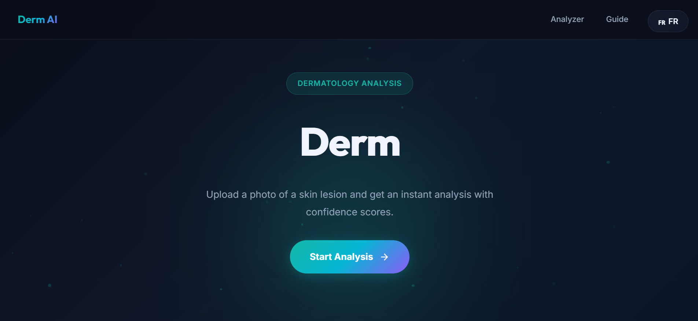
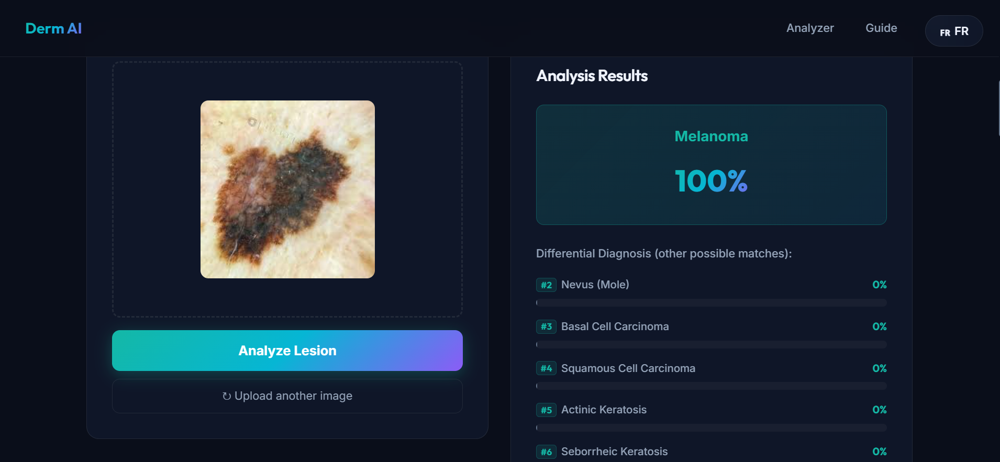

# Derm AI


Skin lesion analysis web application providing zero-shot differential diagnosis with confidence scores, utilizing the DermLIP vision-language model.

## Screenshots

| Landing Page | Lesion Analyzer |
|:---:|:---:|
|  |  |

> ⚠️ **Medical Disclaimer:** For educational and research purposes only. NOT a substitute for professional medical advice. Always consult a qualified dermatologist.

---

## What it does

- **Zero-shot skin lesion classification** across 26 clinically-relevant conditions
- **Differential diagnosis** — shows a Primary Match + 9 alternative conditions ranked by confidence
- **Bilingual interface** — full English / French toggle
- **Drag & drop** image upload (JPG / PNG)
- **Privacy-first** — images processed in memory, never stored

---

## Conditions covered

Drawn from the same benchmark datasets used to evaluate DermLIP in the paper (PAD, HAM10000, Fitzpatrick17k):

**Neoplastic / Pigmented** — Melanoma · Nevus · Basal Cell Carcinoma · Squamous Cell Carcinoma · Actinic Keratosis · Seborrheic Keratosis · Benign Keratosis · Dermatofibroma · Vascular Lesion

**Inflammatory** — Eczema · Seborrheic Dermatitis · Contact Dermatitis · Drug Eruption

**Papulosquamous** — Psoriasis · Lichen Planus · Pityriasis Rosea

**Acneiform** — Acne · Rosacea · Folliculitis

**Pigmentation / Autoimmune** — Vitiligo · Lupus Erythematosus

**Infections** — Tinea/Ringworm · Urticaria · Scabies · Warts · Molluscum Contagiosum

---

## Architecture

```
Image ──► PanDerm-base (BEiT vision encoder) ──► image embedding
                                                        │
                                                  cosine similarity
                                                        │
Text  ──► PubMedBERT-256 (text encoder) ──────► text embeddings
                  ▲
        8 prompt templates per condition
        (prompt ensembling, per paper protocol)
```

**Key design choices:**
- **Prompt ensembling ×8** — each condition's text embedding is the average of 8 differently-phrased prompts. This is the same evaluation strategy used in the Derm1M paper and meaningfully improves accuracy.
- **Pre-computed text embeddings** — all 26×8=208 text encodings run once at server startup, so inference is fast (image encode only at request time).
- **Exact benchmark classnames** — prompts use the precise lowercase strings from HAM10000/PAD/F17K evaluations (`"nevus"`, `"eczema"`, etc.).

---

## Tech Stack

| Layer | Technology |
|---|---|
| Backend | Python 3.9+ · Flask 3.x · flask-cors |
| ML inference | PyTorch 2.x (CPU or CUDA) |
| Vision-language model | OpenCLIP — Derm1M custom fork |
| Image decoding | Pillow |
| Frontend | Vanilla HTML5 · CSS3 · JavaScript (no frameworks) |
| Fonts | Google Fonts — Inter + Outfit |

---

## Quick Start

**Requirements:** Python 3.9+, Git

### macOS / Linux

```bash
# 1. Clone this repo
git clone git@github.com:lamriaimen/derm-ai.git
cd derm-ai

# 2. Create & activate a virtual environment
python3 -m venv venv
source venv/bin/activate

# 3. Clone Derm1M (custom open_clip fork with PanDerm support)
git clone https://github.com/SiyuanYan1/Derm1M.git

# 4. Install PyTorch and pin NumPy < 2 (IMPORTANT)
pip install torch torchvision "numpy<2"

# 5. Install remaining dependencies
pip install -r requirements.txt

# 6. Run  (downloads ~784 MB model weights on first launch)
python3 app.py
```

### Windows

```bash
# 1. Clone this repo
git clone git@github.com:lamriaimen/derm-ai.git
cd derm-ai

# 2. Create & activate a virtual environment
python -m venv venv
.\venv\Scripts\activate

# 3. Clone Derm1M
git clone https://github.com/SiyuanYan1/Derm1M.git

# 4. Install PyTorch >= 2.4 and NumPy < 2 (IMPORTANT — exact versions matter)
pip install "torch>=2.4" torchvision "numpy<2"

# 5. Install remaining dependencies
pip install -r requirements.txt

# 6. Run
python app.py
```

Open **http://localhost:5000**.  
Model weights are cached after the first download.

> **Troubleshooting — `AutoModel requires the PyTorch library`:** Caused by NumPy 2.x crashing PyTorch, or `transformers>=4.47` rejecting torch<2.4. Fix:
> ```bash
> pip install "numpy<2" "transformers>=4.35,<4.47" --upgrade
> ```

---

## Project Structure

```
derm-ai/
├── app.py               # Flask server + DermLIP inference pipeline
├── requirements.txt
├── LICENSE              # MIT (app code) + third-party notices
├── README.md
├── Derm1M/              # git clone https://github.com/SiyuanYan1/Derm1M
│   └── src/open_clip/   # Custom fork with PanDerm vision encoder support
└── static/
    ├── index.html
    ├── style.css
    └── app.js
```

---

## Attribution & Citations

This application uses the **DermLIP** model, **PanDerm** vision encoder, and associated code from the following works. Please cite them if you use this app in academic work:

### Derm1M dataset & DermLIP model
```bibtex
@misc{yan2025derm1m,
  title        = {Derm1M: A Million‑Scale Vision‑Language Dataset Aligned with Clinical Ontology Knowledge for Dermatology},
  author       = {Siyuan Yan and Ming Hu and Yiwen Jiang and Xieji Li and Hao Fei and Philipp Tschandl and Harald Kittler and Zongyuan Ge},
  year         = {2025},
  eprint       = {2503.14911},
  archivePrefix= {arXiv},
  primaryClass = {cs.CV},
  url          = {https://arxiv.org/abs/2503.14911}
}
```

### PanDerm vision encoder
```bibtex
@article{yan2025multimodal,
  title     = {A multimodal vision foundation model for clinical dermatology},
  author    = {Yan, Siyuan and Yu, Zhen and Primiero, Clare and Vico-Alonso, Cristina and Wang, Zhonghua and Yang, Litao and Tschandl, Philipp and Hu, Ming and Ju, Lie and Tan, Gin and others},
  journal   = {Nature Medicine},
  pages     = {1--12},
  year      = {2025},
  publisher = {Nature Publishing Group}
}
```

### Other components
- **OpenCLIP** (MIT) — Cherti et al., CVPR 2023 · [github.com/mlfoundations/open_clip](https://github.com/mlfoundations/open_clip)
- **PubMedBERT** — [NeuML/pubmedbert-base-embeddings](https://huggingface.co/NeuML/pubmedbert-base-embeddings)

---

## License

This project is licensed under **CC BY-NC-ND 4.0** (Creative Commons Attribution-NonCommercial-NoDerivatives 4.0 International).

- **Non-commercial use only** — this application may not be used commercially without written permission
- **No derivatives** — the code and model weights may not be redistributed in modified form
- **Attribution required** — cite the Derm1M and PanDerm papers (see above)

Full license text: https://creativecommons.org/licenses/by-nc-nd/4.0/

---

## Contributors

- Nerdjes Kaoutar BENHAMED
- Mohamed Said Aimen LAMRI
